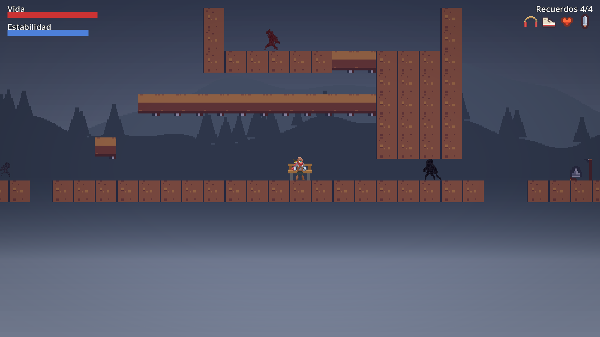
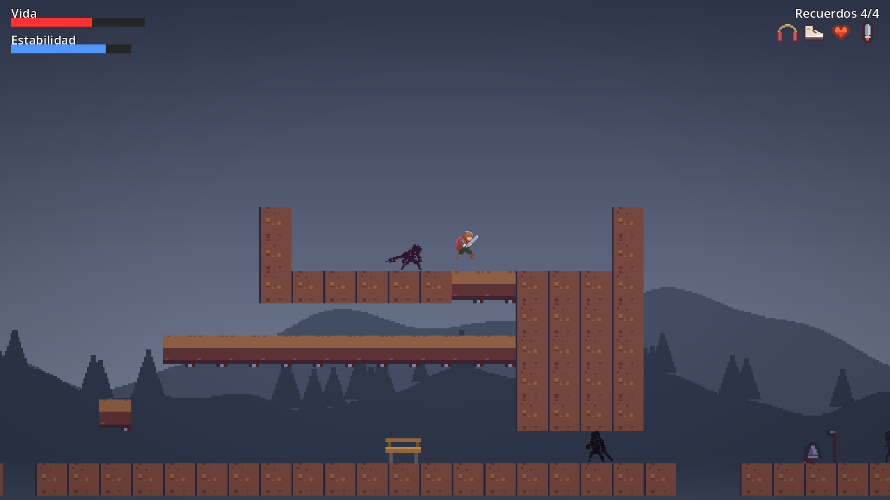
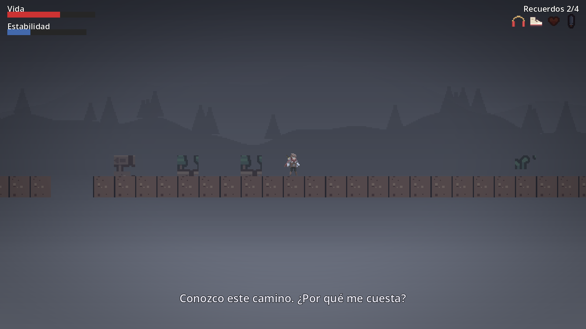
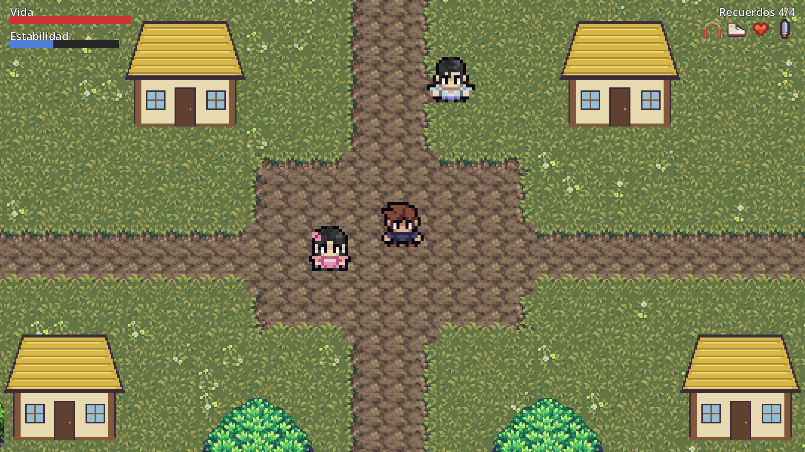

<div align="center">

# El Recuerdo

**Un juego sobre recuperar lo que olvidaste, hecho de a un género por vez.**

*Hermoso, pero algo está mal.*


</div>

| Plataformas 2D | La arena del elite |
|:---:|:---:|
|  |  |
| **La expulsión del recuerdo** | **El pueblo real (vista cenital)** |
|  |  |

---

## La idea

El protagonista recupera **habilidades** recuperando **recuerdos**. A medida que los
recupera, el mundo se vuelve más nítido: primero casi en gris, después con color, música y
profundidad. Pero el recuerdo en el que está atrapado es su propio pueblo natal, y algo
en él no termina de encajar.

- **Tono:** 70 % aventura, 20 % misterio, 10 % melancolía. Nunca "estar mal te hace fuerte",
  nunca moraleja simplona.
- **Estabilidad:** el recurso que gastás al saltar, correr o pelear, y que también marca cuánto
  aguanta un recuerdo. Es el hilo común entre géneros: "seguís siendo vos".
- **Un género por capítulo.** Lo que se mantiene es el tono, el lore, la Estabilidad y los
  recuerdos como habilidades. El Nivel 1 es un plataformas 2D; el pueblo real es cenital; lo
  que venga puede ser turnos, cartas o puzzle. Cada recuerdo se juega con las reglas de quien
  lo recordaba.
- **Proyecto personal de aprendizaje:** la meta es *terminar juegos chicos con identidad
  propia*, no armar el RPG gigante de una sola vez.

## Qué se puede jugar hoy

### Nivel 1: "El Recuerdo" (plataformas)
Un nivel largo hecho de un mapa ASCII, en seis actos. Cada recuerdo abre un tramo con desafíos
que exigen esa habilidad:

| Recuerdo | Habilidad | Qué cambia |
|---|---|---|
| Saltador | Salto | Se enciende un parche de color alrededor del personaje |
| Corredor | Sprint | Aparece el parallax de colinas y pinos |
| Vida | Barra de Vida | El mundo recupera casi todo su color y los objetos de fondo |
| Guerrero | Ataque | Color pleno y la melodía |
| Mirador *(opcional)* | +10 % de Estabilidad | Recompensa por vencer al elite de su arena |

Enemigos con comportamientos propios: patrullas, **guardianes** que bloquean un pasillo y
golpean con telégrafo, **perseguidores** que solo cazan cuando estás en su plataforma y un
**elite** que embiste y queda aturdido si choca contra una pared.

Al final, el recuerdo **expulsa** al protagonista: la Estabilidad se drena sola, el paso se
vuelve pesado, el color y la música se apagan, la Vida empieza a caer y se desploma.
No hay respawn: es un umbral de la historia, no un game over.

### El pueblo real (cenital)
Al despertar, el protagonista está en el pueblo de verdad: una plaza caminable con casas,
árboles y dos NPCs con los que se habla. Es la base del siguiente capítulo (explorar,
conversar y entender la Fractura de a poco). Los textos y varias cifras son de prueba.

## Controles

| Acción | Tecla |
|---|---|
| Moverse | `A` `D` / flechas (en el pueblo también `W` `S`) |
| Saltar | `Espacio` |
| Correr | `Shift` |
| Atacar | `X` |
| Hablar / continuar mensajes | `Enter` |

## Cómo correrlo

1. Instalá [Godot 4.7](https://godotengine.org/download).
2. Generá el arte placeholder (el arte de terceros no está en el repo, ver [Arte](#arte)):
   ```bash
   pip install pillow
   python3 game/tools/gen_placeholder_art.py
   godot --headless --path game --import
   ```
3. Abrí la carpeta `game/` desde el editor y presioná **F5**.

> **Modo prueba:** en `game/scenes/Main.tscn` el nodo `Main` tiene `debug_start_at_end = true`,
> que te da todas las habilidades y te deja junto al último banco para probar el combate y
> la expulsión sin recorrer el nivel entero. Ponelo en `false` para jugar desde el inicio.
> `Town.tscn` se puede correr suelta (F6) para ver el pueblo directo.

## Estructura

```
el-recuerdo/
├── game/                     Proyecto Godot (abrir esta carpeta)
│   ├── levels/               level1.txt (plataformas) y town.txt (pueblo): mapas ASCII
│   ├── scenes/               Main, Town, Core, Player, TopDownPlayer, Enemy, Npc, ...
│   ├── scripts/              Lógica: level_loader, town_loader, player, enemy, hud, ...
│   ├── data/                 Datos: recuerdos y NPCs
│   ├── shaders/              Tinte de mundo (saturación, frío, viñeta)
│   ├── tools/                Generadores reproducibles de arte y sprites
│   └── assets/               Arte y audio (ver Créditos)
├── design/
│   ├── historia_lore.md      Mundo, protagonista, misterio y preguntas abiertas
│   └── documento_base_diseno.md   Sistemas, Estabilidad, niveles y géneros
├── tools/                    Generador de audio (numpy)
├── docs/screenshots/         Capturas de este README
└── CLAUDE.md                 Guía del proyecto para trabajar con agentes
```

### Cómo se conecta
- **El nivel es un dato.** `Main.tscn` no contiene el nivel: `level_loader.gd` lee el `.txt`
  y construye tiles, colisiones, enemigos y recuerdos. Agregar un tipo de objeto es agregar un
  carácter al `match`. El pueblo funciona igual con `town_loader.gd`.
- **Núcleo compartido entre géneros.** HUD, tinte de mundo y audio por capas viven en
  `Core.tscn`, que instancia cada escena. Lo que sobrevive a un cambio de escena (habilidades,
  Vida, Estabilidad) vive en el autoload `GameState`, y `SceneRouter` cambia de escena con fundido.
- **Señales y grupos.** Los nodos se hablan por señales (`ability_unlocked`, `health_changed`,
  `stability_changed`, `collapsed`) y por grupos (`hud`, `audio`, `player`). Si un grupo no
  existe, la llamada es un no-op silencioso.
- **Arte y sonido reproducibles.** Los sprites de enemigos, el parallax, varios íconos y todo
  el audio se generan por script, así que se pueden regenerar y ajustar sin abrir un editor.

## Validar cambios

```bash
cd game
godot --headless --import                 # tras agregar assets nuevos
godot --headless --quit-after 60          # carga el juego real; sin salida = sin errores
```

La corrida headless valida que el juego carga y no crashea, **no** que se sienta bien: los
números de balance, colores y volúmenes se ajustan jugando.

## Arte

Las capturas muestran el juego con su arte final, pero **el repositorio no incluye el arte
de terceros** cuyas licencias no permiten redistribuirlo: el héroe y los enemigos del
plataformas, y todo el pueblo cenital. Para que el proyecto abra igual,
`game/tools/gen_placeholder_art.py` crea figuras simples con los mismos nombres y tamaños.
Si tenés los packs originales, los podés poner en `game/assets/` (o regenerar con
`tools/gen_shadow_enemies.py` y `tools/gen_town_assets.py`) y se ve como en las capturas.

## Créditos y licencias

- Personaje del Nivel 1: *Animated Pixel Adventurer* de [rvros](https://rvros.itch.io/animated-pixel-hero)
  (no incluido en el repo).
- Tiles y objetos del plataformas: [Kenney](https://kenney.nl) (CC0, incluidos). Los enemigos
  son siluetas derivadas del personaje de rvros, generadas por script (no incluidas).
- Pueblo cenital: [Mana Seed](https://seliel-the-shaper.itch.io/) (suelo y árboles) y
  [Mini Adventure Heroes](https://beowulf.itch.io/) (personajes). Packs comprados, no
  incluidos. Detalle en [`game/assets/town/SOURCE.md`](game/assets/town/SOURCE.md).
- Audio, íconos dibujados, parallax y la casa del pueblo: generados por scripts propios.
- El código, el diseño y el lore de este repositorio son propios.

## Hoja de ruta

- [x] Nivel 1 completo: progresión visual y sonora, combate, arena del elite y expulsión
- [x] Núcleo compartido entre géneros y cambio de escena con fundido
- [x] Pueblo real de prueba en vista cenital
- [ ] Playtest humano del nivel largo y ajuste de balance
- [ ] Datos a `Resource` (`.tres`): recuerdos y enemigos
- [ ] Extraer la lógica de Estabilidad y recuerdos del jugador de plataformas
- [ ] Guion del pueblo, interiores y primer **recuerdo ajeno** en un género distinto

El backlog vive en los [issues](https://github.com/edos21/el-recuerdo/issues) del repo, con hitos por capítulo ("Pulido del Nivel 1", "Pueblo real", "Primer recuerdo ajeno").
